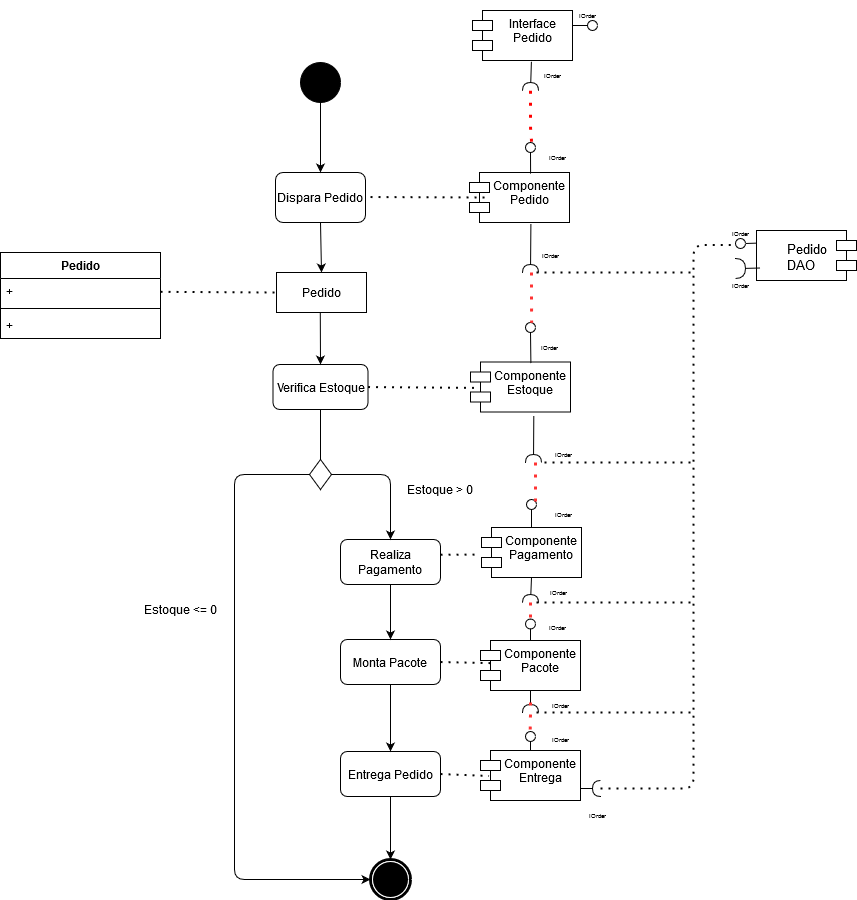
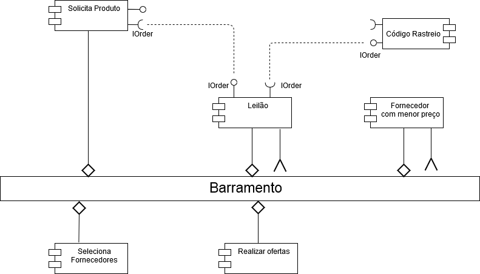

# INF331 - Componentização e Reuso de Software Conceitos e Práticas (2020)

## Tarefa 01
 

 
## Tarefa 02
 
1. O processo se inicia no componente "Solicita Produto" onde o comprador escolhe o que deseja comprar. (Solicita Produto) 
2. O componente leilão se encarrega de gerenciar as mensagens dos componentes no barramento. (Leilão) 
3. Selecionar fornecedores elegiveis a fornecer o produto solicitado. (Seleciona Fornecedores) 
4. O fornecedor oferece o melhor preço para o produto. (Realizar ofertas) 
5. Os tres menores preços serão apresentados e obedecendo o critério de classificação/desempate. (Forncedor com menor preço)  
6. O código de rastreio será enviado após a escolha do fornecedor. (Código Rastreio) 
 

